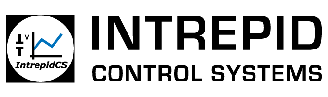

# libneoradio2


# Documentation

libneoradio2 is a library to interface to Intrepid Control Systems, Inc. neoRAD-IO-2 product line. This library is a C library with binding to Python. More language bindings are in the works but unfinished currently.


# Quick Start

This section is meant as a quickstart guide to building / installing libneoradio2


## Python

`pip install neoradio2`

See [README.md](python/) in the python subdirectory for more details.


## Linux

```
$ cmake .
$ make
# make install
```

## Windows

Visual studio 2015 or greater is required to build. cmake can also be used to build but is untested currently.

 -Build needs to be set to 32-bit.

 -hidapi/windows/hidapi.sln project needs to be opened and converted at least once in order to load correctly.


# Examples

Examples can be found under the example directory [here](example/) 

# neoRAD-IO2 Product Line

The neoRAD-IO2 series is a family of ruggedized products that provide an isolated analog, digital or temperature interface to a PC via the PC’s USB port. These tools can also be paired with Intrepid products that include a USB port such as neoVI ION, neoVI FIRE 2, RAD-Galaxy, and RAD-Gigalog. In addition, the neoRAD-IO2-CANHUB can power and convert the native UART signal to CAN or CAN FD for use in any CAN device.

The neoRAD-IO2 family communicates on an open source UART based serial communication protocol. Up to eight devices can be daisy chained. The chain length is limited by current supplied to the chain through USB. All neoRAD-IO2 devices have input to output isolation, and 2.5kV isolation between each of the eight banks. Bank to bank isolation is important because it allows the common mode voltage of each input signal to be different than the other channels in other banks. (This is a major source of measurement error and can damage to the product.) Additionally, noise on one channel will not affect other channels. For more details please visit https://www.intrepidcs.com/products/analog-daq-devices/rad-io2-series/

## License - MIT


Copyright <2019> <Intrepid Control Systems, Inc.>

Permission is hereby granted, free of charge, to any person obtaining a copy of this software and associated documentation files (the "Software"), to deal in the Software without restriction, including without limitation the rights to use, copy, modify, merge, publish, distribute, sublicense, and/or sell copies of the Software, and to permit persons to whom the Software is furnished to do so, subject to the following conditions:

The above copyright notice and this permission notice shall be included in all copies or substantial portions of the Software.

THE SOFTWARE IS PROVIDED "AS IS", WITHOUT WARRANTY OF ANY KIND, EXPRESS OR IMPLIED, INCLUDING BUT NOT LIMITED TO THE WARRANTIES OF MERCHANTABILITY, FITNESS FOR A PARTICULAR PURPOSE AND NONINFRINGEMENT. IN NO EVENT SHALL THE AUTHORS OR COPYRIGHT HOLDERS BE LIABLE FOR ANY CLAIM, DAMAGES OR OTHER LIABILITY, WHETHER IN AN ACTION OF CONTRACT, TORT OR OTHERWISE, ARISING FROM, OUT OF OR IN CONNECTION WITH THE SOFTWARE OR THE USE OR OTHER DEALINGS IN THE SOFTWARE.
